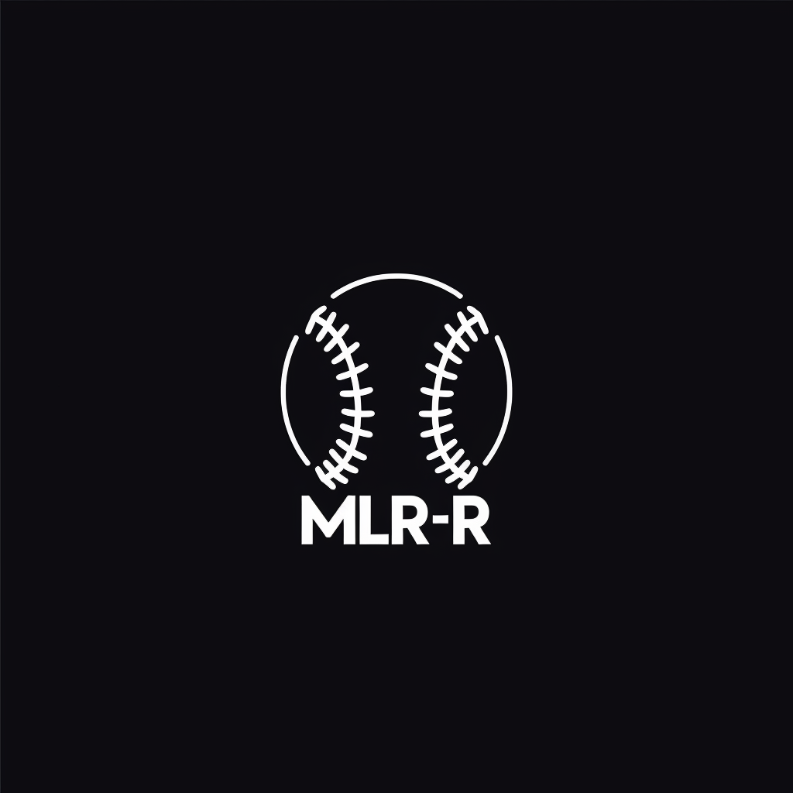

 

  

  

    The MLR-Reference API is a JSON, HTTP API for accessing game data and league information from the Major League Redditball database.
  

## License

Distributed under the MIT License. See `LICENSE.txt` for more information.

## Contact

If you have questions, comments, feature requests, bugs, etc. please let me know!

- Discord @veritablequandary
- MLR Main Discord (Sterling Turlington)
